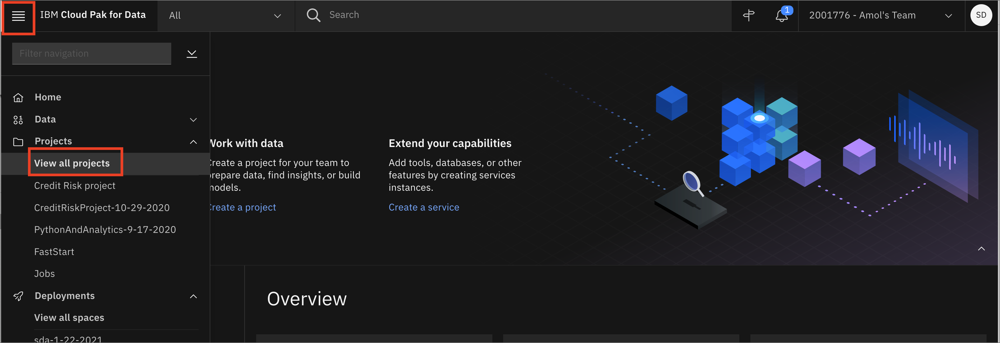

# Data exploration in Python using pandas

### What is data preprocessing?

Process of converting raw data into useful format.In order to better understand the data, we need to gather some statistical insights into our data. In this module of the workshop, we will use some of the libraries available with Python and Jupyter to examine our data set. 

### What is pandas?

[pandas](https://pandas.pydata.org/) is a fast, powerful, flexible and easy to use open source data analysis and manipulation tool,
built on top of the Python programming language.

### Data

We'll use a data set from [Kaggle](https://www.kaggle.com/) for this workshop. You'll need to download it to your local machine, then upload to your project running in Cloud Pak for Data as a Service.

The *insurance.csv* dataset acquired from *Kaggle*  contains 1338 observations (rows) and 7 features (columns). The dataset contains 4 numerical features (age, bmi, children and expenses) and 3 categorical features (sex, smoker and region).

We'll continue to use the [`insurance.csv`](https://www.kaggle.com/noordeen/insurance-premium-prediction/download) file from you project assets, so if you have not already [`downloaded this file`](https://www.kaggle.com/noordeen/insurance-premium-prediction/download) to your local machine, and uploaded it to your project, do that now.

## Getting Started with Jupyter Notebooks

Instead of writing code in a text file and then running the code with a Python command in the terminal, you can do all of your data analysis in one place. Code, output, tables, and charts can all be edited and viewed in one window in any web browser with [Jupyter Notebooks](https://jupyter.org/). As the name suggests, this is a notebook to keep all of your ideas and data explorations in one place. 

Jupyter notebooks are an open-source web application that allows you to create and share documents that contain live code, equations, visualizations and explanatory text.

## Open the Jupyter notebook

* Go the (☰) navigation menu and under the *Projects* section click on *`All Projects`*.

* Click the project name you created in the pre-work section.

* From your `Project` overview page, click on the *`Assets`* tab to open the assets page where your project assets are stored and organized.

* Scroll down to the `Notebooks` section of the page and click on the pencil icon at the right of the `insurance_premium_pandas_preprocessing.ipynb` notebook.

* When the Jupyter notebook is loaded and the kernel is ready, we will be ready to start executing it in the next section.

## Run the Jupyter notebook

Spend some time looking through the sections of the notebook to get an overview. A notebook is composed of text (markdown or heading) cells and code cells. The markdown cells provide comments on what the code is designed to do.

You will run cells individually by highlighting each cell, then either click the `Run` button at the top of the notebook or hitting the keyboard short cut to run the cell (`Shift + Enter` but can vary based on platform). While the cell is running, an asterisk (`[*]`) will show up to the left of the cell. When that cell has finished executing a sequential number will show up (i.e. `[17]`).

> **Note: Some of the comments in the notebook (those in bold red) are directions for you to modify specific sections of the code. Perform any changes as indicated before running / executing the cell.**

## Load and Prepare Dataset

* Section `2.0 Load the data` will load the data set we will use to build out machine learning model. In order to import the data into the notebook, we are going to use the code generation capability of Watson Studio.

* Highlight the code cell below by clicking it. Ensure you place the cursor below the first comment line.

* Click the `01/00` "Find data" icon in the upper right of the notebook to find the data asset you need to import.

* For your dataset, Click `Insert to code` and choose `Insert Pandas DataFrame`. The code to bring the data into the notebook environment and create a Pandas DataFrame will be added to the cell below.

* Run the cell and you will see the first five rows of our dataset.

* Since we are using generated code to import the data, you will need to update the next cell to assign the `df` variable. Copy the variable that was generated in the previous cell ( it will look like `df=data_df_1`, `data_df_2`, etc) and assign it to the `df` variable (for example `df=df_data_1`).

## Continue to run the notebook

* Finish running all of the cells. Carefully read all of the markdown comments to gain some understanding of how data analysis and manipulation can be done to gain insight into the data set.
